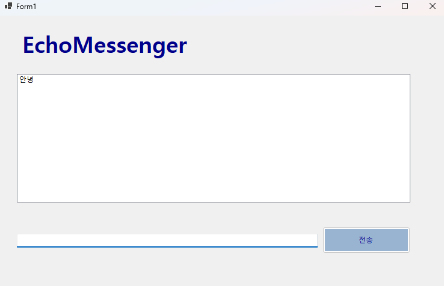
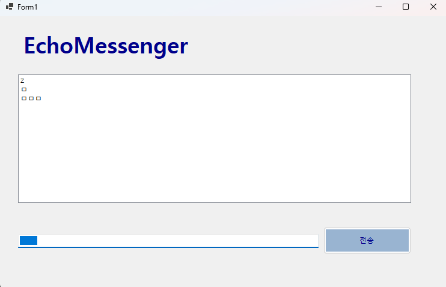

# (C# 코딩)

## 개요

-C# 프로그래밍 학습

-1줄소개: 사용자의 메세지를 입력받아 메세지 박스에 저장하는 프로그램

-사용한 플랫폼: 
 -C#, .NET Windows Forms, Visual Studio, GitHub

-사용한 컨트롤:
 -Label, TextBox, ListBox, Button

-사용한 기술과 구현한 기능:
 -Visual Studio를 이용하여UI 디자인
 -string 클래스를 이용한 사용자 입력 데이터 처리
 -메소드를 이용해 공백제거 및 공백만 입력시 예외처리 구현

## 실행화면(과제1)
  
-과제1코드의실행스크린샷

-과제내용
 -Label(표시), TextBox(입력), Button(전송), ListBox(대화창)를적절히배치
 -전송 버튼 클릭시 TextBox의 텍스트를ListBox의 항목 (Items)으로 추가

-구현 내용과 기능 설명
 -입력창에 메시지 입력하고 전송버튼을 누르면 메시지가리스트박스에 표시된다.
 -계속 반복하면 메시지가 리스트 박스에 한줄 씩 계속 추가된다.
 -추가내용이 많아지면 리스트박스에 스크롤바가 자동으로 생기고스크롤된다.

 ## 실행화면(과제2)
 
 -과제2코드의실행스크린샷
 
 
 
 -과제내용
  -엔터 키를 누르면 전송
  -전송 버튼을 마우스로 클릭시 자동으로 텍스트 박스에 포커스
  -공백만 입력시 입력 X
 
 -구현내용과기능설명
  -엔터 키를 누르면 텍스트 박스의 내용이 리스트 박스로 전송된다.
  -전송 버튼을 마우스로 클릭시 자동으로 텍스트 박스에 포커스 된다.
  -공백만 입력시 입력되지 않는다.

## 배운내용
 텍스트 박스, 리스트 박스의 사용법을 배웠다.
 문자열 관련 매소드IsNullOrWhiteSpace 의 사용 방법에 대해 알게 되었다
 텍스트 박스에서 사용하는 매소드를 이용할 수 있게 되었다.
 특히 clear, focus를 사용하여 텍스트 박스의 내용을 지우고 포커스 시키는 방법을 배웠다.
